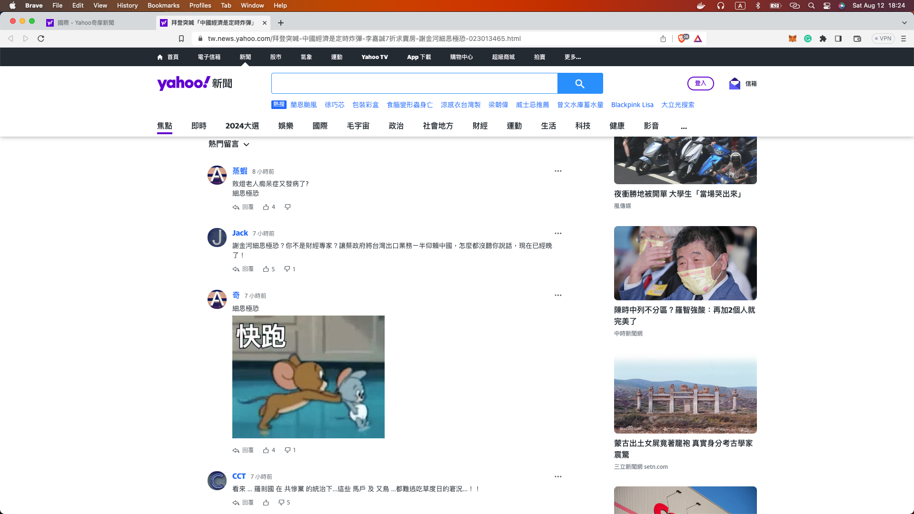

# Yahoo News comments scraper
This project is a simple scraper that scrapes the comments from Yahoo News articles and stores them in a database. The comments then can be retrieved through an API endpoint for further analysis.

## Project structure

### APP
A simple nodejs application that provides the API endpoints and schedules the crawling job periodically.

### Crawler
A playwright based crawler that crawls the comments from Yahoo News articles at https://tw.news.yahoo.com/world/ and stores them in the database.

Target articles page


Target comments page



### Database
A postgres database to store the comments.

## Prerequisites
* Docker

## How to run

*Create the volume for the database*
```
docker volume create yahoo-news-comments-db  
```

*Start the containers*
```
docker-compose -f docker-compose.prod.yml up
```

*Stop the containers*

```
docker-compose down -f docker-compose.prod.yml
```

## APIs

### Get all articles with comments
```
GET http://localhost:3000/articles
```

### Get crawler schedules
```
GET http://localhost:3000/schedules
```

### Create a crawler schedule
```
POST http://localhost:3000/schedules
Body:
{
  "hour": number,
  "minute": number,
  "second": number
}
```